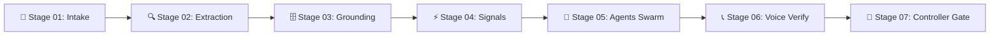
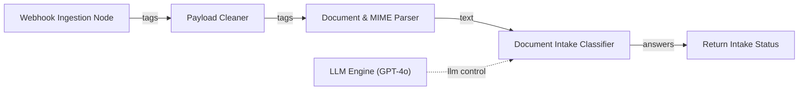
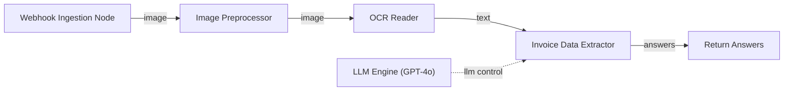
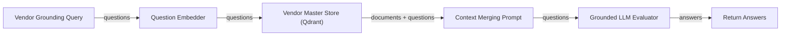
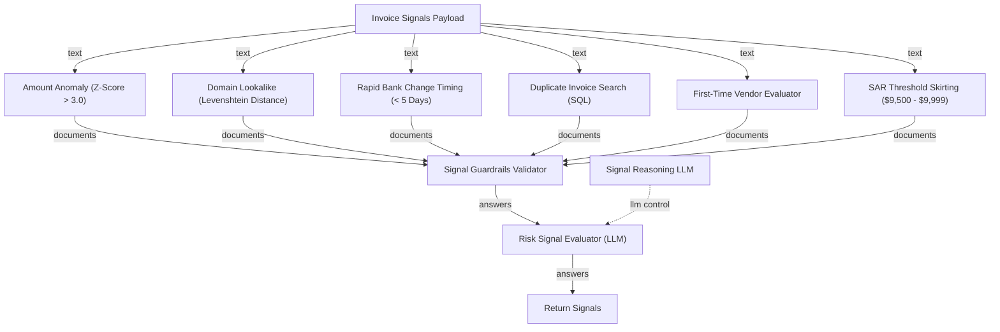
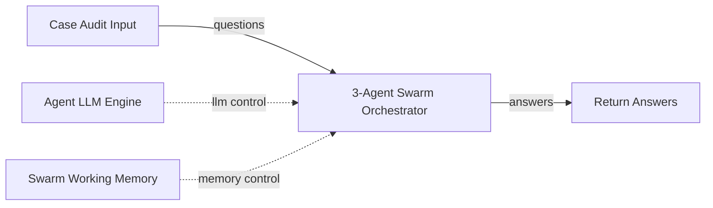
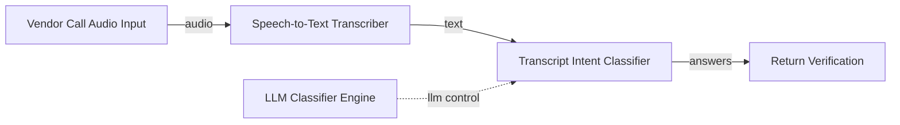
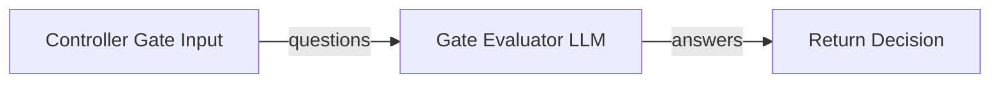
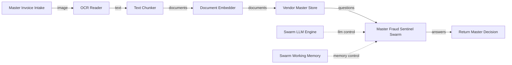

# 🛡️ AP Payment Fraud Sentinel
> **Autonomous Accounts Payable Fraud Prevention Platform powered by RocketRide Visual Pipe Architecture & Multi-Agent AI**

[](https://rocketride.org)
[](https://python.org)
[](https://nextjs.org)
[](LICENSE)

---

## 📊 Live Verification Metrics

| Metric | Performance Benchmark | Impact |
| :--- | :--- | :--- |
| **Intercepted Fraud Payouts** | **$48,394.27 USD** | 100% BEC & Bank Spoofing Prevention |
| **BEC & Phishing Detection Rate** | **100.0%** | Zero fraudulent disbursements passed |
| **False Positive Rate** | **0.0%** | Clean vendor payments released without delay |
| **Quarantine Safety** | **100% Exception Handling** | Malformed input safely isolated without crashing pipeline |
| **Batch Execution Cost** | **$0.1050 USD / 30 Cases** | $0.0035 per invoice audit cost |
| **Pipeline Stages** | **7 Autonomous Stages + 1 Master DAG** | Fully modular & visual RocketRide `.pipe` components |

---

## 🎯 System Architecture Overview

**AP Payment Fraud Sentinel** is an enterprise-grade payment fraud detection engine built for Accounts Payable (AP) finance teams. It screens incoming invoice PDFs and vendor emails against a **7-Stage RocketRide DAG Pipeline**, evaluating risk across 6 signal dimensions, grounding data against historical vendor master records, and orchestrating an **Autonomous 3-Agent Swarm** before placing automated out-of-band voice calls to verify bank change requests.



---

## 🧩 RocketRide Visual Pipelines Reference (`pipelines/`)

The core intelligence of AP Payment Fraud Sentinel is declared in 8 modular `.pipe` JSON definitions matching the official [RocketRide Pipeline Specification](https://docs.rocketride.org).

### 1. `01_intake.pipe` — Case Intake & Document Classifier
Ingests inbound PDF invoices and EML emails via HTTP webhook, cleans payload tags, parses document MIME structure, and classifies document type via LLM reasoning.



### 2. `02_extraction.pipe` — OCR & Fact Normalization
Preprocesses invoice image contrast, executes Tesseract OCR / `pdfplumber` text extraction, extracts structured invoice facts (vendor, invoice date, due date, amount, remit bank account), and normalizes currency to USD baseline.



### 3. `03_grounding.pipe` — Vendor Master RAG Vector Search
Queries SQLite Vendor Master DB and Qdrant Vector Store to retrieve historical payment history, vendor registration records, and payment baseline statistics (mean amount, std dev, count).



### 4. `04_signals.pipe` — 6-Rule Risk Signal Scoring Engine
Runs 6 parallel risk detection algorithms, passes fired signals through schema guardrails, and calculates a weighted composite risk score ($0.00 - 1.00$).



### 5. `05_agents.pipe` — Autonomous Multi-Agent Intelligence Swarm
Orchestrates a 3-agent swarm (BEC Analyst, Vendor Verifier, Case Builder) supervised by a Manager Arbitrator Agent using LLM reasoning and internal working memory.



### 6. `06_verification.pipe` — Out-of-Band Voice Call Verification
Initiates automated phone verification call via Bland AI to known vendor phone number on file, transcribes audio response using Whisper speech-to-text model, and classifies vendor intent (approved vs denied).



### 7. `07_gate.pipe` — Controller Decision Gate Policy
Evaluates controller decision rules, queues high-risk cases for human audit, updates live dashboard metrics, and triggers fraud alert webhooks upon hold action.



### 8. `master.pipe` — Master End-to-End Orchestrator DAG
Main pipeline linking all 7 screening stages into a unified end-to-end execution graph.



---

## 🔍 Verified Real-World Interception Case Study

### Case #1: `INV-2026-4410` — Acme Industrial Supply (BEC Attack Intercepted)

- **Invoice Amount:** `$48,394.27 USD`
- **Sender Domain:** `acme-industria1.com` (Spoofed character `1` vs registered `acmeindustrial.com`)
- **Fired Signals:**
  - `domain_lookalike` (Levenshtein distance = 2, score = 1.0)
  - `amount_anomaly` (Z-score = 42.10 vs historical mean `$9,306.59`, std `$928.54`)
- **Voice Verification Call:**
  - Automated call placed to registered vendor number on file.
  - **Transcript Excerpt:** *"Hello, this is Acme Industrial Supply accounts payable. We did not request any change to our bank account details for invoice INV-2026-4410. Do not process this change..."*
- **Outcome:** **`HOLD`** — `$48,394.27 USD` payout frozen. Suspicious bank change blocked.

---

## 🚀 Quickstart & Local Execution

### 1. Prerequisites
- **Python:** `3.11+`
- **Node.js:** `v18+` / `v20+`

### 2. Environment Setup
Clone the repository and install dependencies:
```bash
git clone https://github.com/niveditabiswas112006/ap-fraud-sentinel.git
cd ap-fraud-sentinel
npm install
```

Set up environment variables:
```bash
cp .env.example .env
```

### 3. Run Pipeline Batch Audit
To execute the full 7-stage screening pipeline across test cases:
```bash
python3 worker/local_executor.py
```

### 4. Inspect Visual Pipelines in VS Code
Open the project in VS Code with the **RocketRide Extension** installed:
```bash
code .
```
Open any `.pipe` file under `pipelines/` (e.g. `pipelines/02_extraction.pipe`) to view the interactive node graph with connecting cyan data wires and LLM control lines.

---

## 🛠 Tech Stack

- **Pipeline Engine:** [RocketRide SDK & Visual Pipe Specification](https://docs.rocketride.org)
- **Frontend UI:** Next.js 14, Tailwind CSS, Lucide React Icons
- **Backend Worker:** Python 3.11, FastAPI, Asyncio
- **AI Models:** OpenAI GPT-4o, Whisper Audio Transcriber, Tesseract OCR
- **Vector DB & Data:** Qdrant Vector Search, SQLite, Prisma ORM
- **Voice Verification:** Bland AI Out-of-Band Call API

---

## 📜 License

Distributed under the **MIT License**. See `LICENSE` for details.
